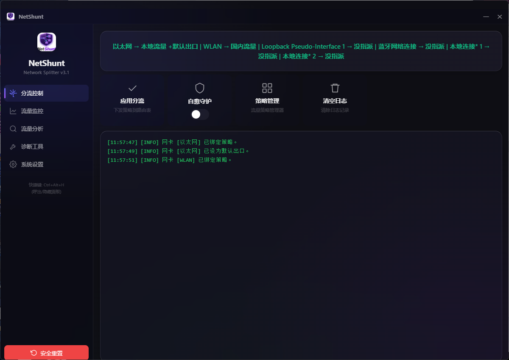

<div align="center">

# NetShunt

## Windows 多网卡策略路由与网络分流工具

让内网、VPN、专线和互联网流量，按规则走指定网卡。

[](LICENSE)
[]()
[]()
[]()

</div>

> 公司内网走有线网卡，互联网走 Wi-Fi，VPN 只访问指定网段？
>
> NetShunt 可以按 IP/CIDR 将不同流量分配到指定网卡，同时保留默认网络出口。

NetShunt 是一款面向 Windows 工程师、IT 运维人员和高级个人用户的多网卡策略路由与网络分流工具。

这样可以实现：

- 公司内网地址通过以太网访问
- 生产网地址通过 VPN 访问
- 普通互联网流量继续使用 Wi-Fi
- 不需要频繁手动修改 Windows 路由表

## 截图

| 首页 | 策略路由 | 诊断工具 |
|:---:|:---:|:---:|
|  |  |  |

## 适用用户

- IT 运维人员
- 网络工程师
- 软件开发人员
- 测试工程师
- 使用 VPN 的企业员工
- 使用 VMware、Hyper-V、Docker 或 WSL 的用户
- 需要同时连接多个网络的高级个人用户
- 家庭多线路或多网卡用户

## 功能

- **策略路由管理** — 创建/编辑/删除分流策略，按 CIDR 规则将流量绑定到指定网卡
- **Fallback 默认出口** — 自动维护默认路由，确保非分流流量正常通行
- **自愈守护** — 后台监控路由表状态，异常时自动修复
- **安全重置** — 一键清理所有已注入路由，恢复系统默认路由表
- **流量监控** — 实时查看各网卡上下行流量
- **诊断工具** — 内置 Ping / Tracert / Nslookup / Netstat / 端口检测 / 测速
- **i18n 双语** — 中文 / English 一键切换
- **多主题** — 透明毛玻璃 / 紫色 / 苹果浅色
- **全局快捷键** — Ctrl+Alt+H 切换窗口显隐
- **系统托盘** — 最小化到托盘，网卡事件原生通知
- **自动更新** — 启动时检查新版，右下角弹窗提醒，一键下载安装

## 安全说明

NetShunt 需要管理员权限，因为 Windows 路由表和网卡配置属于系统级网络资源。

NetShunt 主要执行以下操作：

- 读取本机网卡和路由信息
- 添加、更新和删除由 NetShunt 管理的路由
- 监控网卡状态和路由状态
- 执行用户主动发起的网络诊断命令

使用前建议保存当前网络配置。遇到网络异常时，可以使用"安全重置"清理 NetShunt 添加的规则并恢复系统默认路由。

NetShunt 不应修改与自身策略无关的系统路由，也不会在后台收集用户的网络流量内容。

## 快速开始

1. 下载最新版本安装包
2. 以管理员权限运行 NetShunt
3. 在"网卡管理"中查看并配置网卡角色
4. 在"策略路由"中创建分流规则
5. 为规则选择目标网卡
6. 点击"应用"
7. 使用内置诊断工具验证实际网络路径

## 安装

### 安装包（推荐）

下载 `NetShunt_3.3.1_Setup.exe`，双击安装即可。安装包已内置 WebView2 Runtime Bootstrapper，无需额外环境。

### 从源码构建

```bash
# 需要 Go 1.21+ 和 Wails CLI
go install github.com/wailsapp/wails/v2/cmd/wails@latest

git clone https://github.com/flecklesreeder-design/NetShunt.git
cd NetShunt/chenflow-go

wails build -clean -webview2 embed
# 产物在 build/bin/NetShunt.exe
```

## 技术栈

| 层 | 技术 |
|---|---|
| 后端 | Go 1.21 |
| 桌面框架 | Wails v2 |
| 前端 | HTML + CSS + JS |
| 渲染 | WebView2 |
| 安装包 | Inno Setup 6 |

## 项目结构

```
chenflow-go/
├── app.go                    # API 桥接层（策略/网卡/诊断/更新）
├── main.go                   # Wails 入口
├── internal/
│   ├── adapter/manager.go    # 网卡检测
│   ├── config/store.go       # 配置持久化
│   ├── models/models.go      # 数据模型
│   ├── routing/engine.go     # 路由引擎
│   └── utils/utils.go        # 工具函数（GBK解码/进程隐藏等）
├── frontend/dist/            # 嵌入前端（go:embed）
└── build/windows/            # exe 图标 / manifest / 版本信息
```

## 关键词

Windows 多网卡、Windows 策略路由、Windows 网络分流、指定网卡出站、VPN 分流、Split Tunnel、Multi-NIC、Policy Routing、Traffic Routing、CIDR 路由、静态路由、多个默认网关、内外网分流、双网卡上网、双网卡内外网、network adapter routing。

## 支持

如果这个项目对你有帮助，欢迎请我喝杯咖啡 ☕

<div align="center">

| 微信支付 | 支付宝 |
|:---:|:---:|
|  |  |

</div>

也可提 Issue 或 Star ⭐ 支持。

## License

[MIT](LICENSE)

## Contact

924636096@qq.com
